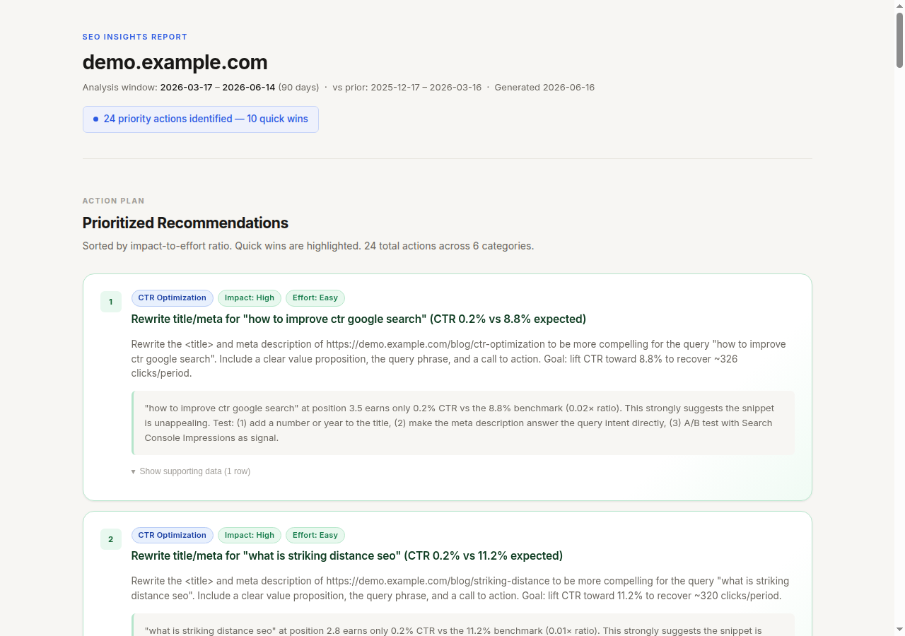

# seo-insights

A Claude Skill that produces **deep, deterministic SEO analysis** from Google Search Console (GSC) data. Every number is computed in Python directly from your GSC export — no third-party SaaS, no black-box scoring, no hallucinated metrics. The output is a **prioritized list of concrete action recommendations**, each backed by traceable GSC evidence, not a data dump. Designed to be run weekly so that each run automatically enables week-over-week (WoW) comparison.

Works in both **Claude Code** and **Claude Cowork**: drop the repo in your project, point Claude at `SKILL.md`, and let it guide you through the analysis interactively.

---

## What You Get

Each run produces a self-contained `report.html` and a machine-readable `report_data.json` covering:

| Analysis | What it finds |
|---|---|
| **Striking-distance quick wins** | Queries ranking 4–20 with high impressions — the lowest-effort path to more clicks |
| **Keyword cannibalization** | Multiple pages competing for the same query, splitting authority |
| **CTR outliers** | Pages/queries where your actual CTR is far below the position-curve expectation |
| **Content decay** | Pages losing clicks or impressions over the analysis window |
| **On-page audit** | Missing `<title>`, thin content, duplicate meta descriptions, H1 issues |
| **Core Web Vitals** | LCP / CLS / INP scores via PageSpeed Insights API (skipped gracefully if no key) |
| **Week-over-week comparison** | Clicks, impressions, CTR, and position delta vs. the preceding equal-length window |

Recommendations are scored by `impact × effort` and sorted — quick wins come first.

---

## Screenshot



See [examples/sample-report.html](examples/sample-report.html) for a full interactive pre-rendered demo report.

---

## Quickstart

### Demo mode (no credentials required)

```bash
git clone https://github.com/yourname/seo-insights
cd seo-insights
pip install -r requirements.txt
bash scripts/demo.sh
```

This runs the full pipeline on synthetic fixture data and validates the output. No GSC account or API key needed.

### Real data

1. **Set up GSC OAuth** — follow [SETUP.md](SETUP.md) (5–10 minutes, one-time).
2. **Fill in your ICP** — copy the template and describe your audience:
   ```bash
   cp config/icp.example.yaml config/icp.mysite.yaml
   # edit config/icp.mysite.yaml
   python3 scripts/validate_icp.py config/icp.mysite.yaml
   ```
3. **Run the pipeline:**
   ```bash
   bash scripts/run.sh --icp config/icp.mysite.yaml
   ```
   The script prints the path to `report.html` when done.
4. **Run weekly** — each run creates `data/<domain>/<YYYY-MM-DD>/`, enabling automatic WoW comparison on the next run.

---

## How It Works

```
GSC API
  │
  ▼
scripts/fetch.py
  Pulls current window (default: last 90 days) + equal-length prior window
  → data/<domain>/<date>/        (queries, pages, dates, countries, devices)
  → data/<domain>/<date>/prior/  (same structure, prior period)
  │
  ▼
scripts/build_report_data.py
  Runs 7 deterministic analysis modules in Python:
    striking_distance · cannibalization · ctr_outliers
    content_decay · onpage_crawl · core_web_vitals · wow_compare
  Scores and ranks recommendations
  → data/<domain>/<date>/report_data.json
  │
  ▼
scripts/report.py
  Renders Jinja2 template with Chart.js charts
  → data/<domain>/<date>/report.html  (self-contained, no server needed)
  │
  ▼
Claude (LLM narration only)
  Reads report_data.json, presents top recommendations as a prioritized
  action plan. Numbers always quoted from JSON — never invented.
```

The `scripts/run.sh` wrapper runs all four steps in sequence with a single command.

---

## Requirements

- Python 3.10 or later
- `pip install -r requirements.txt` (`pyyaml`, `jinja2`)
- A Google Search Console property with data (for live mode)
- Optional: PageSpeed Insights API key for Core Web Vitals

---

## As a Claude Skill

This repo ships with `SKILL.md` — a machine-readable skill definition that Claude Code and Claude Cowork can use to orchestrate the full analysis interactively. Claude will:

1. Ensure a valid ICP exists (interviewing you if needed).
2. Check auth and guide you through setup if needed.
3. Run the pipeline.
4. Read `report_data.json` and present a prioritized action plan.

---

## License

MIT — see [LICENSE](LICENSE).
